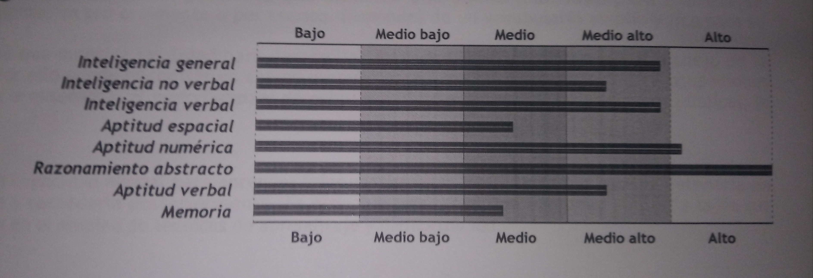

<h1 align="center">Andres Fernandez Buron</h1> 

<table width="100%" border="0" cellpadding="0" csellspacing="0" align="center">
<thead>
	<tr>
		<td colspan="2">
			<pre>  
    _              _ 
   / \   _ __   __| |_ __ ___  ___ 
  / _ \ | '_ \ / _` | '__/ _ \/ __|
 / ___ \| | | | (_| | | |  __/\__ \
/_/   \_\_| |_|\__,_|_|  \___||___/
 _____                               _ 
|  ___|__ _ __ _ __   __ _ _ __   __| | ___ ____
| |_ / _ \ '__| '_ \ / _` | '_ \ / _` |/ _ \_  /
|  _|  __/ |  | | | | (_| | | | | (_| |  __// / 
|_|  \___|_|  |_| |_|\__,_|_| |_|\__,_|\___/___|
 ____  
| __ ) _   _ _ __ ___  _ __ 
|  _ \| | | | '__/ _ \| '_ \ 
| |_) | |_| | | | (_) | | | |
|____/ \__,_|_|  \___/|_| |_|
			</pre>
		</td>
	</tr>
<tr> <td colspan="2">  </td> </tr>
<tr>
	<td width="50%" align="center" valign="top">
		 
Muy buenas, soy Andrés, un desarrollador de España.
  
		
Puedes visitar mi <a href="https://andres123dev.github.io/" target="_blank">sitio web frontend</a>.
  
		
Además, en mi perfil puedes ver algunos pequeños proyectos cómo:
  
		 
	</td>
	<td width="50%" align="center" valign="top">
		 
Greetings, I'm Andres, a developer from Spain.
  
		
You can visit my <a href="https://andres123dev.github.io/" target="_blank">frontend web site</a>.
  
		
Moreover, in my profile you can see some little projects like:
    
	</td>
</tr>
<tr>
	<td colspan="2"> 
		<ul>
			<li> <a href="https://github.com/andres123dev/my-seo-analyzer/">My SEO analyzer</a>  
				  Script to request a HTML webpage, analyze the SEO of the response and generate a report in PDF format. 
			</li>
			<li> <a href="https://github.com/andres123dev/my-url-scraper/">My URL scraper</a>  
				  Terminal app to make a HTTP request to an URL and analyze interactively the response.  
			</li>
			<li> <a href="https://github.com/andres123dev/andres123dev.github.io/">My frontend website</a>  
				  My frontend website at https://andres123dev.github.io/
			</li>
			<li> <a href="https://github.com/andres123dev/my-crud/">My CRUD</a>  
				  A web CRUD using singleton pattern.  
			</li>
			<li> <a href="https://github.com/andres123dev/my-paint-board-vanilla/">My PaintBoard vanilla</a>  
				  Paint board as local web application.  
			</li>
			<li> <a href="https://github.com/andres123dev/my-paint-board/">My PaintBoard</a>  
				  An improved web Paint board.  
			</li>
		</ul> 
	</td>
</tr>
<tr><th align="center" valign="middle" colspan="2"> GitHub stats: </th></tr>
<tr>
	<td align="center">
		
	</td>
	<td>
		
  		<!---->
	</td>
</tr>
</thead>

<tbody>
<tr>
	<th align="center" valign="middle" colspan="2"> Multiplatform development: </th>
</tr>
<tr>
	<td width="50%" align="left" valign="top">
		 
		 
		 
		
	</td>
	<td width="50%" align="right" valign="top">
		 
		 
		  
		<a href="">Windows</a>
	</td>
</tr>
<tr>
<tr>
	<th align="center" valign="middle" colspan="2"> Web development: </th>
</tr>
<tr>
	<td width="50%" align="left" valign="top"> Frontend languages:   
		 
		 
		 
	</td>
	<td width="50%" align="right" valign="top"> Backend languages:   
		 
	</td>
</tr>
<tr>
	<td width="50%" align="left" valign="top"> Frameworks:   
		 
		 
		 
		 
	</td>
	<td width="50%" align="right" valign="top"> CMS:   
		 
	</td>
</tr>

<tr>
	<th align="center" valign="middle" colspan="2"> Data Bases: </th>
</tr>
<tr>
	<td width="50%" align="left" valign="top"> DB Management Systems:   
		 
		 
		 
		 
		 
	</td>
	<td width="50%" align="right" valign="top"> DB clients:   
		
		
		
	</td>
</tr>

<tr>
	<th align="center" valign="middle" colspan="2"> More tools: </th>
</tr>
<tr>
	<td width="50%" align="left" valign="top">
		
		 
		 
		
		
	</td>
	<td width="50%" align="right" valign="top">
		 
	</td>
</tr>

</tbody>
</table>

